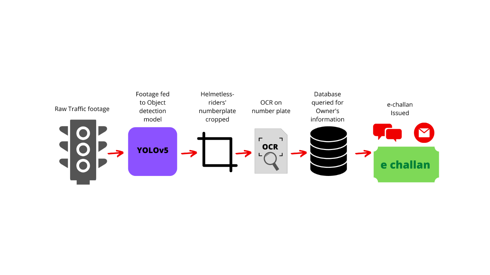
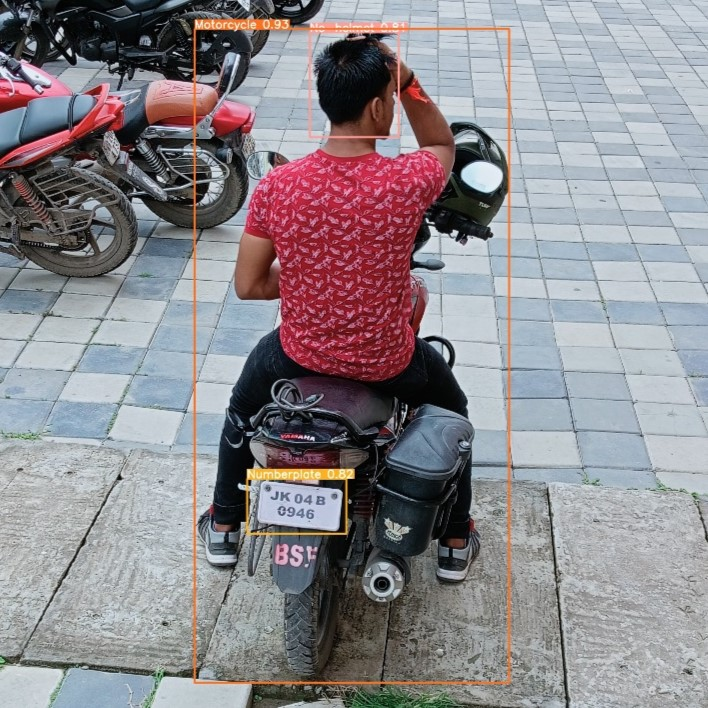
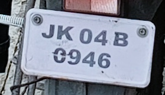
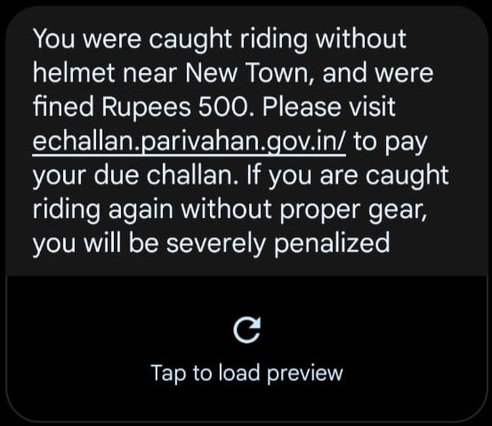
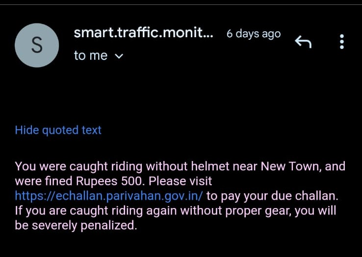
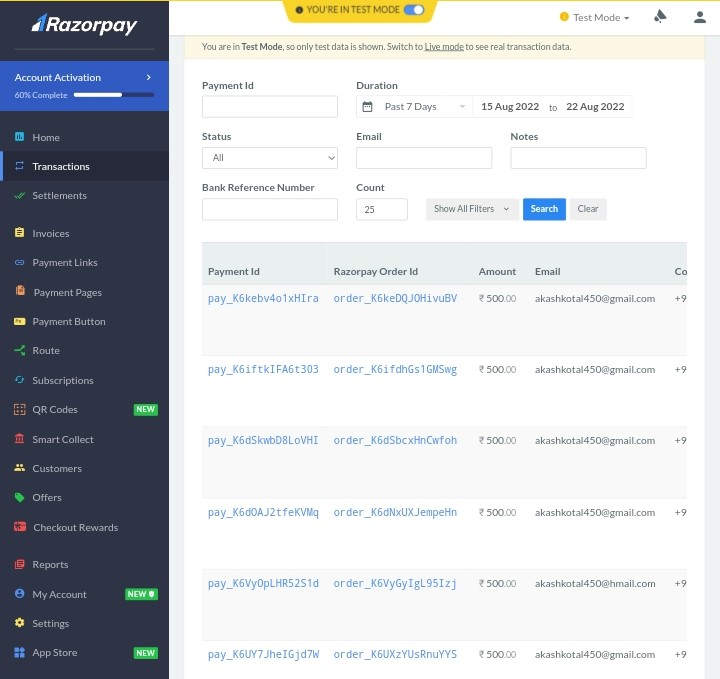

# **Detection of helmet-less riders in Indian roads using Machine learning**

<br><br/>

## **Context:**

Indian traffic system is one of the busiest in the world. Naturally, it
is hard to manually monitor and enforce traffic laws everywhere. So, we
propose a novel solution for the enforcement of traffic laws on Indian
roads using Artificial Intelligence and computer vision. 

<br><br/>

## **Problem statement:**

According to Ministry of Road Transport and Highways, as many as 158,964
two-wheeler road accidents took place in India in 2020, which caused
56,873 deaths, a fraction of which occurred due to the absence of a
helmet. In spite of various campaigns launched by various state
government and introduction of various penalties, this is still a
problem in Indian roads and endangers India's young citizens' life.

<br><br/>

## **Our solution:**

We propose an automated system to enforce the use of helmet in Indian
roads and the penalty collection system.

<br><br/>

## **Proposed Methodology:**



<br><br/>

## **Development Process:**

1.  Data collection & labelling: We used YOLOv5, which is an open-source
    deep learning platform for the detection of motorcycle, helmet and
    helmetless riders and their number plate. The data necessary for the
    training of the model was collected from our college campus, and
    labelled manually using MakeSense, which is an online annotation
    tool.

2.  Training: YOLOv5 is fed the labelled images, and it learns to
    predict the co-ordinates of the bounding boxes.

<br><br/>

### **Example detection output:**

 
|                                |                                  |
|--------------------------------|----------------------------------|
|  |    |

<br><br/>

After our model detects a rider without a helmet, it scans and crops the
number plate of the two-wheeler, which is then passed to an OCR package.
For our project, we used python's EasyOCR library.

<br><br/>

### **OCR on number plate:**


 
# ***-> JK04B0946***

<br><br/>

After recognizing the license-plate number, our model queries a database
which contains the information of all of the registered riders in India
for their Name, Phone number and email. An e-challan is issued on the
rider's name, which they are notified using mail and text SMS with
proper information about where, when and what type of violation was done
by him.

<br><br/>

### **Sample SMS & Mail alert:**

|          SMS                   |              E-Mail              |
|--------------------------------|----------------------------------|
|  |    |

<br><br/>

We did not have access to actual Indian vehicle registration data, so we
used a dummy database, which we created and tested on. For the payment
portal, we used a RazorPay payment gateway, which will then store the
payment information in a database.

<br><br/>

### **Payment Dashboard of admin:**



<br><br/>

## **Future scope:**

Our system can be used to detect and enforce any traffic violation. The
most novel Idea would be to detect overweighing detection and dangerous
carriage of construction materials.

During the actual implementation, the system requires High-definition
CCTV cameras, and GPU accelerated servers for real time detection from
CCTV footage. The actual national vehicle-registration database should
be used, and an actual e-challan payment gateway should be connected to
the database.

# **To use the system:**
- Requirements: All necessary python libraries mentioned in requirements.txt.

```
$ git clone https://github.com/rumbleFTW/traffic-two-wheeler-monitoring.git
$ cd traffic-two-wheeler-monitoring
$ pip install -r ./requirements.txt
$ chmod +x ./app.sh
$ ./app.sh PATH_TO_SOURCE
```
N.B. PATH_TO_SOURCE is the path to the image/video footage to be analyzed. This path will be the relative path of the media with respect to the yolo folder.